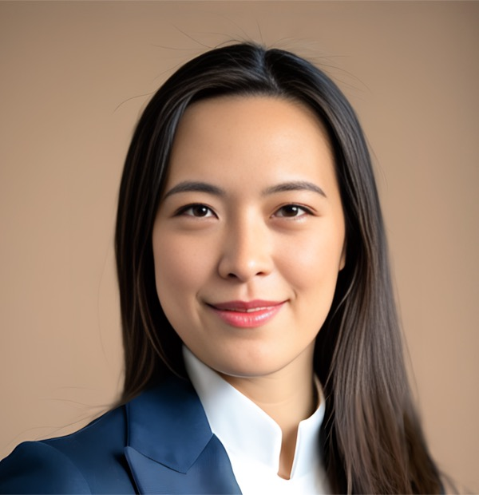

# Therapy for Founders & Executives | Diana Chu, LMFT

> Telehealth therapy for executives and founders in California and Florida. Diana Chu, LMFT, RDT. Executive burnout, anxiety, and high-achieving couples.

Canonical URL: https://dianachutherapy.com/

---

LMFT  ·  RDT  ·  Stanford GSB Facilitator  ·  CA & FL

## Clarity for the high-stakes life

Private telehealth therapy for executives, founders, and high-achieving professionals navigating burnout, leadership pressure, and the weight of success.

[Book a Consultation →](contact.html)
[Explore Services](services.html)

Scroll

High performance demands *high support*: therapy designed for the way you actually live.

Licensed Marriage & Family Therapist

California Institute of Integral Studies

Diana Chu, LMFT, RDT  ·  San Francisco, CA

About Diana

## A therapist who understands the pressure you carry

I work with executives, founders, and driven professionals who are exceptional at what they do and privately exhausted by it. The people carrying the most responsibility are often the least likely to ask for help. My practice is built for them.

I'm a Licensed Marriage and Family Therapist and Registered Drama Therapist in San Francisco. I also serve as an Interpersonal Dynamics Facilitator at Stanford GSB, working with executives and MBA students on emotional intelligence, communication, and self-awareness. I offer confidential telehealth sessions for clients in [California](san-francisco-therapist.html) and [Florida](florida-therapist.html).

LMFT #105546  ·  RDT #659

MA Counseling Psychology, CIIS

Stanford GSB Facilitator

EMDR  ·  Gottman Method

[Read My Story →](about.html)

"The most capable people in the room are often the ones least likely to ask for help."

On high-achieving clients

10+

Years of Experience

Clinical practice

CA · FL

Licensed States

Secure telehealth

50min

Per Session

Individual & couples

"
> Working with Diana was the first time I felt truly seen, not despite my ambition, but including it.

Executive Client  ·  San Francisco, CA

## How I can help

Each service is built around the specific demands of high-achievement. This isn't general wellness work. It's clinical therapy for people whose situations are genuinely complex.

01

### Individual Therapy

One-on-one telehealth sessions for executives, CEOs, and founders dealing with burnout, leadership anxiety, career transitions, or the accumulated weight of a high-stakes life. We work on what's actually going on, not just the surface.

$500

per 50-min session

[Learn More →](services.html#individual)

02

### Couples Therapy

For dual-career couples and co-founders whose relationship has taken a back seat to everything else. We use the Gottman Method to work through real communication and connection problems, not just manage conflict.

$500

per 50-min session

[Learn More →](services.html#couples)

03

### Telehealth

All sessions are via secure video. No commute, no waiting room, no rearranging your day around an office. Available to clients in [California](san-francisco-therapist.html) and [Florida](florida-therapist.html), from wherever you happen to be.

CA & FL

licensed telehealth

[Learn More →](services.html#telehealth)

Therapy that keeps pace with your ambition.

[Begin Today →](contact.html)

## Perspectives on high performance

[All Articles →](blog.html)

Starting Therapy
May 2025

### [Do High Achievers Actually Need Therapy?](blog/do-i-need-therapy-executives.html)

A direct answer for the people who keep deferring therapy because they're functioning well on paper. What the threshold actually is, and why waiting until you're in crisis is the wrong bar.

[Read Article →](blog/do-i-need-therapy-executives.html)

Founder Life
April 2026

### [Why Founders Don't Sleep: The Psychology of Hypervigilance](blog/founders-sleep-hypervigilance.html)

It's 2am. Nothing is on fire. You are still running scenarios. Founder insomnia is not a sleep problem. It is a nervous system that has forgotten how to stand down.

[Read Article →](blog/founders-sleep-hypervigilance.html)

Leadership
February 2026

### [The Loneliness of Leadership](blog/loneliness-of-leadership.html)

Surrounded by people and functionally alone with the things that matter most. Why leadership loneliness runs deeper than most peer groups can reach, and what actually interrupts the pattern.

[Read Article →](blog/loneliness-of-leadership.html)

In-Depth Guides

## Long-form reference for founders doing the research.

Two comprehensive guides on founder mental health and on how to find a clinician who fits.

[Research Review  ·  14 min read

### Founder Mental Health: What the Data Actually Shows

A clinician's review of the research on entrepreneur mental health, with citations and the clinical patterns that correspond to the numbers.

Read Guide →](guides/founder-mental-health-statistics.html)
[Founder's Guide  ·  12 min read

### Best Therapist for Founders in California: What to Look For

What to evaluate, what to avoid, and how to narrow the field. Credentials, red flags, cost, and consultation questions.

Read Guide →](guides/best-therapist-for-founders-california.html)

"
> I've worked with coaches and advisors my whole career. Diana is the first person who helped me understand why I kept making the same decisions and how to actually change.

Startup Founder  ·  Miami, FL

Take the first step

## Your performance depends on your foundations.

A 20-minute consultation is confidential, free, and without obligation. Let's explore whether we're the right fit.

[Book a Free Consultation →](contact.html)
[Common Questions](faq.html)

Telehealth  ·  California & Florida  ·  Out-of-network provider
